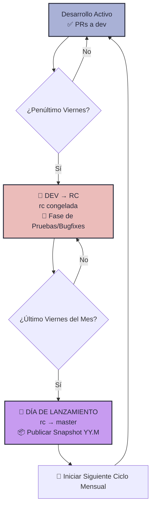
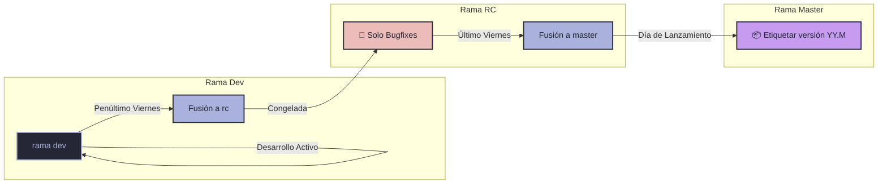

## Política de Ramas y Lanzamientos — Lanzamientos Mensuales Predictivos

[Ir al Calendario](#calendario-de-lanzamientos-mensuales-para-2026)

#### Puntos Clave

1. **🛠️ Desarrollo** - Todo el desarrollo activo y los Pull Requests (PRs) se dirigen a la rama `dev`.
2. **🚫 Semana de Freeze (Congelación)** - El **penúltimo viernes de cada mes**, la rama `dev` se fusiona con la rama `rc` (release-candidate), la cual queda *congelada* únicamente para pruebas y corrección de errores (bugfixes).
3. **✅ Día de Lanzamiento** - El **último viernes de cada mes**, la rama `rc` ya estabilizada se fusiona con `master` y se publica el lanzamiento oficial.
4. **📦 Snapshots** - Los Snapshots oficiales se publican directamente desde `master` el Día de Lanzamiento.
5. **🔄 Calendario Predictivo** - Un ritmo mensual simple: desarrollo activo durante todo el mes hasta el penúltimo viernes, seguido de exactamente **una semana de pruebas/congelación**, finalizando con el lanzamiento el último viernes.

> [!NOTE] 
> La rama `dev` siempre está abierta para nuevas funciones y desarrollo *todas* las semanas. Solo la rama `rc` se congela para estabilización durante el periodo de pruebas.

---

## Desglose Semanal (Ciclo Mensual)

| Fase | Estado de la Rama `dev` | Estado de la Rama `rc` | Cambios Permitidos | Descripción |
| :--- | :--- | :--- | :--- | :--- |
| **Desarrollo Activo** (Inicio de mes al Penúltimo Viernes) | ✅ **ABIERTA** | ✅ **ABIERTA** | ✅ Todo el desarrollo va a `dev` y se fusiona a `rc` | Desarrollo general e implementación de nuevas características. |
| **Periodo de Freeze** (Del Penúltimo al Último Viernes) | ✅ **ABIERTA** | 🚫 **CONGELADA** | ❌ Sin nuevas funciones en `rc`<br/>✅ Solo corrección de errores en `rc` | Exactamente **1 semana** de pruebas de regresión y mejoras de estabilidad. |
| **Día de Lanzamiento** (Último Viernes) | ✅ **ABIERTA** | 🔄 **FUSIONANDO** | 🔄 Fusión de `rc` → `master` y creación de etiqueta de release | Despliegue oficial del Snapshot mensual. |

---

## Versionado YY.M

Utilizamos un formato de versionado simple **año.mes** (`YY.M`) para nuestros lanzamientos mensuales:

- **Claridad temporal:** Muestra al instante el año y el mes del lanzamiento (por ejemplo, `26.5` es el lanzamiento de mayo de 2026).
- **Simplicidad:** No requiere números arbitrarios de parche o versiones menores, ya que los lanzamientos ocurren una vez al mes.
- **Predictible:** Sigue fielmente el mes calendario.

---

## Pull Requests (Solicitudes de Cambio)

- *Deben* realizarse apuntando a la rama `dev`.
- Deben ser revisados y aprobados por al menos otro desarrollador antes de fusionarse.
- Pueden crearse en cualquier momento, pero deben fusionarse en `dev` antes del Día de Freeze para ser incluidos en el lanzamiento de ese mes.

---

# Diagramas de Flujo

## Ciclo de Vida Mensual de las Ramas



## Estructura de Flujo de Ramas



---

# Calendario de Lanzamientos Mensuales para 2026

| Mes | Viernes de Freeze (Penúltimo) | Viernes de Lanzamiento (Último) | Etiqueta (Tag) |
| :--- | :--- | :--- | :--- |
| **Ene** | 2026-01-23 | 2026-01-30 | 26.1 |
| **Feb** | 2026-02-20 | 2026-02-27 | 26.2 |
| **Mar** | 2026-03-20 | 2026-03-27 | 26.3 |
| **Abr** | 2026-04-17 | 2026-04-24 | 26.4 |
| **May** | 2026-05-22 | 2026-05-29 | 26.5 |
| **Jun** | 2026-06-19 | 2026-06-26 | 26.6 |
| **Jul** | 2026-07-24 | 2026-07-31 | 26.7 |
| **Ago** | 2026-08-21 | 2026-08-28 | 26.8 |
| **Sep** | 2026-09-18 | 2026-09-25 | 26.9 |
| **Oct** | 2026-10-23 | 2026-10-30 | 26.10 |
| **Nov** | 2026-11-20 | 2026-11-27 | 26.11 |
| **Dic** | 2026-12-18 | 2026-12-25 🎄 | 26.12 |

---

## 📅 Guía Paso a Paso por Mes — Estado de las Ramas (Mayo – Diciembre 2026)

Esta sección detalla exactamente qué pasa con cada rama cada viernes bajo la política de freeze el penúltimo viernes y lanzamiento el último.

```
rama master ───► Recibe código estable de rc el Último Viernes del mes (Release Day)
rama dev    ───► Siempre abierta para desarrollo activo
rama rc     ───► Se congela el Penúltimo Viernes del mes y se libera el Último Viernes
```

---

### 📅 MAYO 2026

#### Viernes 1, 8 y 15 de mayo — Desarrollo Activo
*   **dev**: Abierta. Todo el desarrollo y PRs van aquí.
*   **rc**: Abierta.
*   **master**: Estable (versión anterior).

#### 🚫 Viernes 22 de mayo (Penúltimo Viernes) — Freeze Day
*   **Acción**: Se fusiona `dev` → `rc`.
*   **Estado de `rc`**: **CONGELADA**. Solo se permiten parches y corrección de bugs para la versión `26.5` durante esta semana de testing.

#### 🚀 Viernes 29 de mayo (Último Viernes) — Release Day
*   **Acción**: Se fusiona `rc` → `master` y se publica oficialmente la versión **`26.5`** 📦.

---

### 📅 JUNIO 2026

#### Viernes 5 y 12 de junio — Desarrollo Activo
*   **dev**: Abierta. Desarrollo y PRs normales.
*   **rc**: Abierta.

#### 🚫 Viernes 19 de junio (Penúltimo Viernes) — Freeze Day
*   **Acción**: Se fusiona `dev` → `rc`.
*   **Estado de `rc`**: **CONGELADA**. Solo se permiten bugfixes para la versión `26.6` durante esta semana de testing.

#### 🚀 Viernes 26 de junio (Último Viernes) — Release Day
*   **Acción**: Se fusiona `rc` → `master` y se publica oficialmente la versión **`26.6`** 📦.

---

### 📅 JULIO 2026

#### Viernes 3, 10 y 17 de julio — Desarrollo Activo
*   **dev**: Abierta. Desarrollo y PRs normales.
*   **rc**: Abierta.

#### 🚫 Viernes 24 de julio (Penúltimo Viernes) — Freeze Day
*   **Acción**: Se fusiona `dev` → `rc`.
*   **Estado de `rc`**: **CONGELADA**. Solo se permiten bugfixes para la versión `26.7` durante esta semana de testing.

#### 🚀 Viernes 31 de julio (Último Viernes) — Release Day
*   **Acción**: Se fusiona `rc` → `master` y se publica oficialmente la versión **`26.7`** 📦.

---

### 📅 AGOSTO 2026

#### Viernes 7 y 14 de agosto — Desarrollo Activo
*   **dev**: Abierta. Desarrollo y PRs normales.
*   **rc**: Abierta.

#### 🚫 Viernes 21 de agosto (Penúltimo Viernes) — Freeze Day
*   **Acción**: Se fusiona `dev` → `rc`.
*   **Estado de `rc`**: **CONGELADA**. Solo se permiten bugfixes para la versión `26.8` durante esta semana de testing.

#### 🚀 Viernes 28 de agosto (Último Viernes) — Release Day
*   **Acción**: Se fusiona `rc` → `master` y se publica oficialmente la versión **`26.8`** 📦.

---

### 📅 SEPTIEMBRE 2026

#### Viernes 4 y 11 de septiembre — Desarrollo Activo
*   **dev**: Abierta. Desarrollo y PRs normales.
*   **rc**: Abierta.

#### 🚫 Viernes 18 de septiembre (Penúltimo Viernes) — Freeze Day
*   **Acción**: Se fusiona `dev` → `rc`.
*   **Estado de `rc`**: **CONGELADA**. Solo se permiten bugfixes para la versión `26.9` durante esta semana de testing.

#### 🚀 Viernes 25 de septiembre (Último Viernes) — Release Day
*   **Acción**: Se fusiona `rc` → `master` y se publica oficialmente la versión **`26.9`** 📦.

---

### 📅 OCTUBRE 2026

#### Viernes 2, 9 y 16 de octubre — Desarrollo Activo
*   **dev**: Abierta. Desarrollo y PRs normales.
*   **rc**: Abierta.

#### 🚫 Viernes 23 de octubre (Penúltimo Viernes) — Freeze Day
*   **Acción**: Se fusiona `dev` → `rc`.
*   **Estado de `rc`**: **CONGELADA**. Solo se permiten bugfixes para la versión `26.10` durante esta semana de testing.

#### 🚀 Viernes 30 de octubre (Último Viernes) — Release Day
*   **Acción**: Se fusiona `rc` → `master` y se publica oficialmente la versión **`26.10`** 📦.

---

### 📅 NOVIEMBRE 2026

#### Viernes 6 y 13 de noviembre — Desarrollo Activo
*   **dev**: Abierta. Desarrollo y PRs normales.
*   **rc**: Abierta.

#### 🚫 Viernes 20 de noviembre (Penúltimo Viernes) — Freeze Day
*   **Acción**: Se fusiona `dev` → `rc`.
*   **Estado de `rc`**: **CONGELADA**. Solo se permiten bugfixes para la versión `26.11` durante esta semana de testing.

#### 🚀 Viernes 27 de noviembre (Último Viernes) — Release Day
*   **Acción**: Se fusiona `rc` → `master` y se publica oficialmente la versión **`26.11`** 📦.

---

### 📅 DICIEMBRE 2026

#### Viernes 4 y 11 de diciembre — Desarrollo Activo
*   **dev**: Abierta. Desarrollo y PRs normales.
*   **rc**: Abierta.

#### 🚫 Viernes 18 de diciembre (Penúltimo Viernes) — Freeze Day
*   **Acción**: Se fusiona `dev` → `rc`.
*   **Estado de `rc`**: **CONGELADA**. Solo se permiten bugfixes para la versión `26.12` durante esta semana de testing.

#### 🚀 Viernes 25 de diciembre (Último Viernes) — Release Day 🎄
*   **Acción**: Se fusiona `rc` → `master` y se publica oficialmente la versión **`26.12`** 📦 (último lanzamiento del año).
